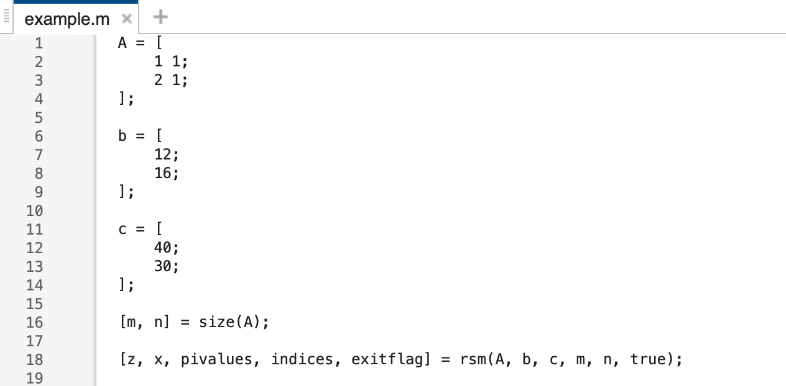
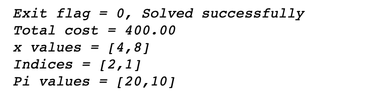

# Reserve Simplex Method Solver #

## About ##

The function in the file `rms.m` solves linear programming minimisation problems in the form :
$$ \text{Minimise } c*x $$
Subject to constraints :
$$ A*x = b \text{, } x >= 0 $$
Performs a two-phase method, starting with Phase I procedure with an all artificial basis and then calls simplex Uses modified leaving variable criterion (when in Phase II).

## Arguments / Inputs ##

- `A` : 2D coefficient matrix  
- `b` : RHS constraint vector
- `c` : Cost coefficients
- `m` : # of constraints
- `n` : # of variables
- `verbose` : Set to `1` to print output or `0` to not print

## Outputs ##

- `z` : Final total cost
- `x` : Final variable values
- `pivalues` : Dual for the constraints
- `indices` : Final indices of the non-basic variables
- `exitflag` : returns `0` if solved successfully, `1` if infeasible, and `-1` if unbounded

# Example #

## Code ##

## Output ##

